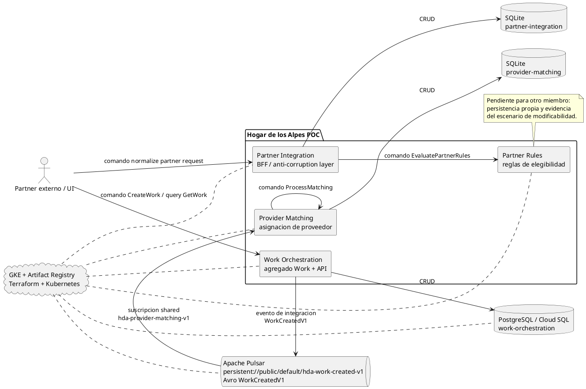

# Arquitectura POC - Entrega 4

El diagrama fuente esta en `docs/architecture.puml`.

```plantuml
@startuml
left to right direction
skinparam componentStyle rectangle

actor "Partner externo / UI" as Partner

package "Hogar de los Alpes POC" {
  [Partner Integration\nBFF / anti-corruption layer] as PI
  [Partner Rules\nreglas de elegibilidad] as PR
  [Work Orchestration\nagregado Work + API] as WO
  [Provider Matching\nasignacion de proveedor] as PM
}

queue "Apache Pulsar\npersistent://public/default/hda-work-created-v1\nAvro WorkCreatedV1" as Pulsar
database "PostgreSQL / Cloud SQL\nwork-orchestration" as DB
database "SQLite\npartner-integration" as PIDB
database "SQLite\nprovider-matching" as PMDB
cloud "GKE + Artifact Registry\nTerraform + Kubernetes" as GCP

Partner --> PI : comando normalize partner request
Partner --> WO : comando CreateWork / query GetWork
PI --> PR : comando EvaluatePartnerRules
PI --> PIDB : CRUD
note bottom of PR
  Pendiente para otro miembro:
  persistencia propia y evidencia
  del escenario de modificabilidad.
end note
WO --> DB : CRUD
WO --> Pulsar : evento de integracion\nWorkCreatedV1
Pulsar --> PM : suscripcion shared\nhda-provider-matching-v1
PM --> PM : comando ProcessMatching
PM --> PMDB : CRUD

GCP .. PI
GCP .. PR
GCP .. WO
GCP .. PM
GCP .. Pulsar
GCP .. DB
@enduml
```
